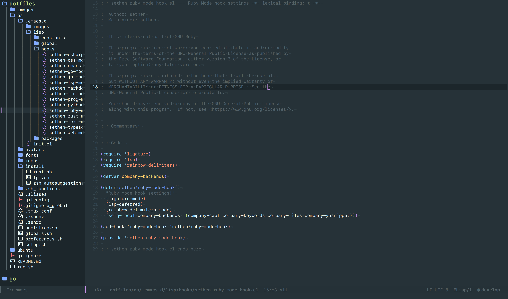

These are my dotfiles for setting up my environment from nothing. Take and use anything you want.

# Quickstart

1. Install `zsh` in your terminal by using `sudo apt install zsh`
2. Modify the `.gitconfig` file in the `os` directory to have your name and email
3. Open `Software & Updates` in Ubuntu and check `Source Code` or you will get errors with installations
4. Execute the `run.sh` file while in `zsh`

# Environments

These dotfiles detect which environment they are in and run the appropriate commands.  The environments tested are:

* Ubuntu 22.04 LTS (older versions not tested or supported)

# Colors

The colors I use for my various terminal environments are found in the Doom Material theme for Emacs.  The hex and RGB values are:

* BLUE: hex `#82aaff`, rgb `(130,170,255)`
* PALE_BLUE: hex `#89ddff`, rgb `(137,221,255)`
* GREEN: hex `#c3e88d`, rgb `(195,232,141)`
* GREY: hex `#263238`, rgb `(38,50,56)`
* ORANGE: hex `#f78c6c`, rgb `(247,140,108)`
* PURPLE: hex `#c792ea`, rgb `(199,146,234)`
* RED: hex `#f07178`, rgb `(240,113,120)`
* YELLOW: hex `#ffcb6b`, rgb `(255,203,107)`
