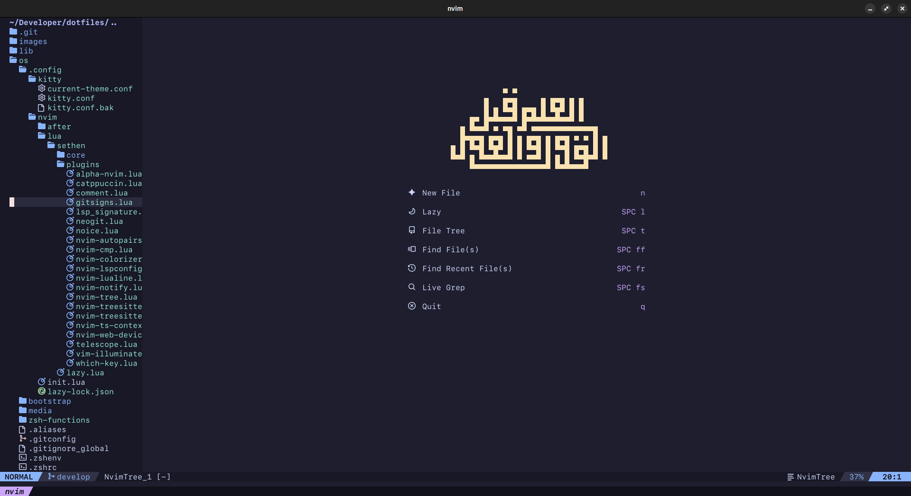

These are my dotfiles for setting up my environment from nothing. Take and use anything you want.

# Quickstart

1. Install `zsh` in your terminal by using `sudo apt install zsh`
2. Modify the `.gitconfig` file in the `os` directory to have your name and email
3. Execute the `run.sh` file while in `zsh`

# Environments

These dotfiles detect which environment they are in and run the appropriate commands.  The environments tested are:

* Ubuntu 23.10 LTS (older versions not tested or supported)
