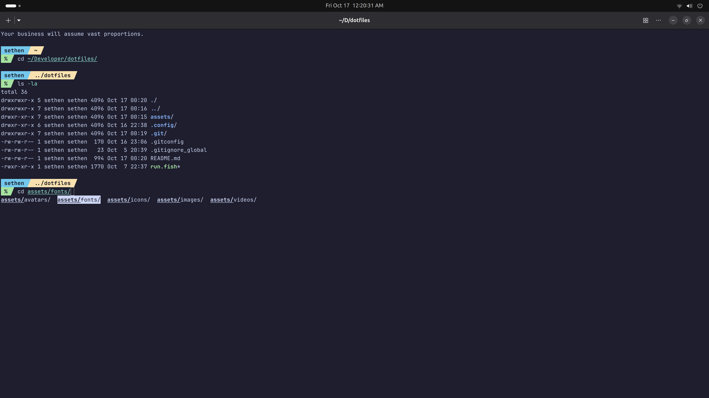
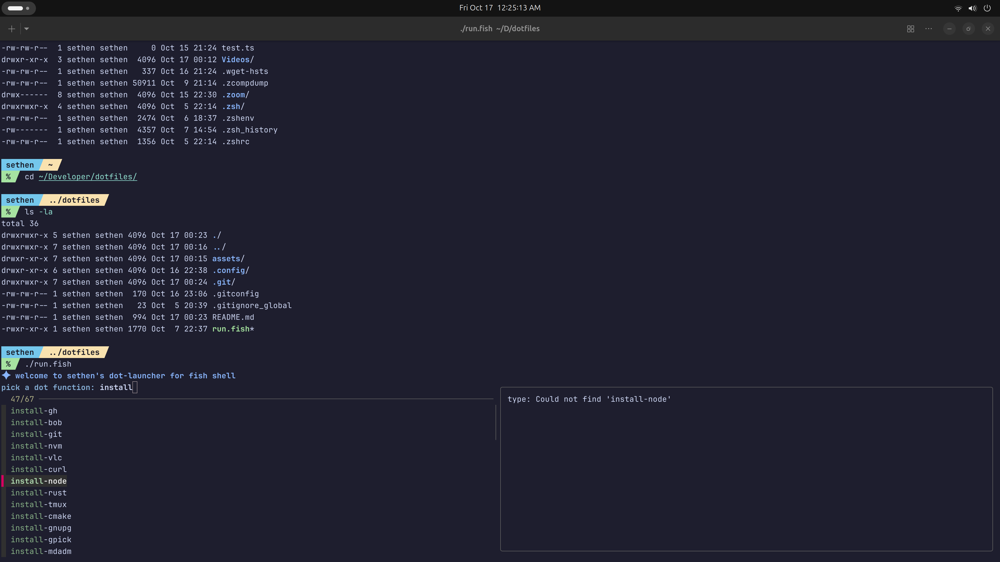
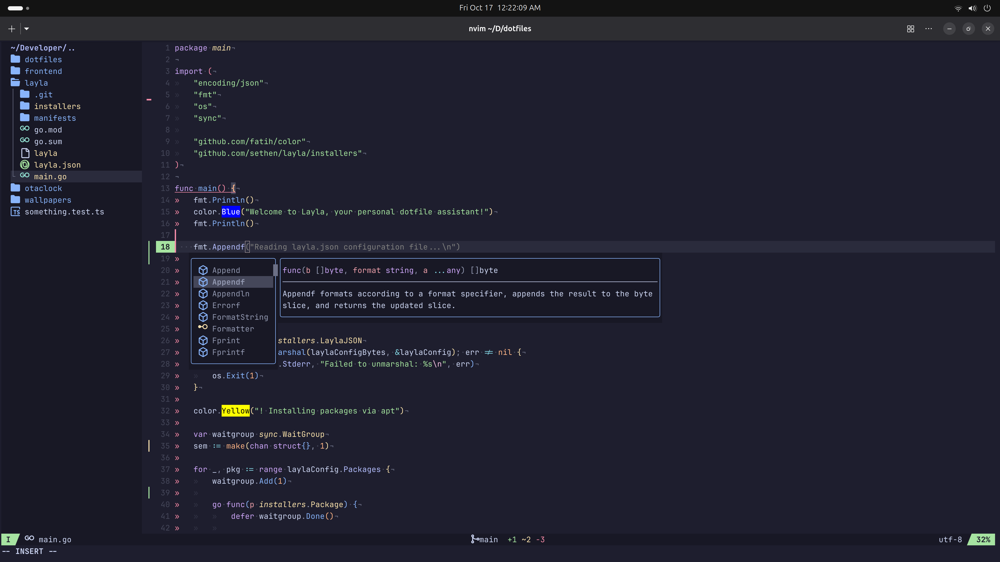

These are my dotfiles for setting up my environment from nothing. Take and use anything you want.

# Intro

These are fish scripts that run other fish scripts.  The main script is `run.fish`.  Each script has a function inside of it and it does one thing like install neovim or set up git.  You can run every function individually or run them all with the `run-all` dot-function.  Each environment has it's own `run-all` command.

## Ghostty with Starship & Fish

## Dot Launcher
A custom launcher for all of your dotfiles.  Run them all or one at a time.

## Neovim

# Quickstart

1. Install `fish` in your terminal using your package manager of choice
2. Modify the `.gitconfig` file in the `os` directory to have your name and email
3. Execute the `run.fish` file while in `fish`
4. Pick the `run-all` dot function

# Environments

* Arch (this can be run before setting up your desktop environment)
* Darwin
* Ubuntu 24.10
